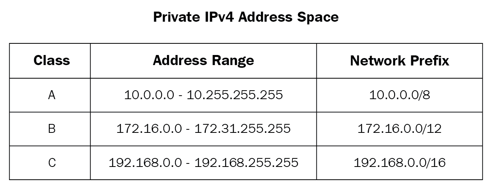

## Private IP address ranges




## Enabling NAT in Linux
```
# Enable IP Forwarding
echo "net.ipv4.ip_forward = 1" | sudo tee -a /etc/sysctl.conf
sudo sysctl -p

# Install iptables if it not already installed
dnf install -y iptables

# Making a catchall rule for routing and masking the private IP
# Change the ens5 interface name accordingly
sudo iptables -t nat -A POSTROUTING -o ens5 -s 0.0.0.0/0 -j MASQUERADE

# Make sure to stop the source/destination check in the EC2 instance
```


